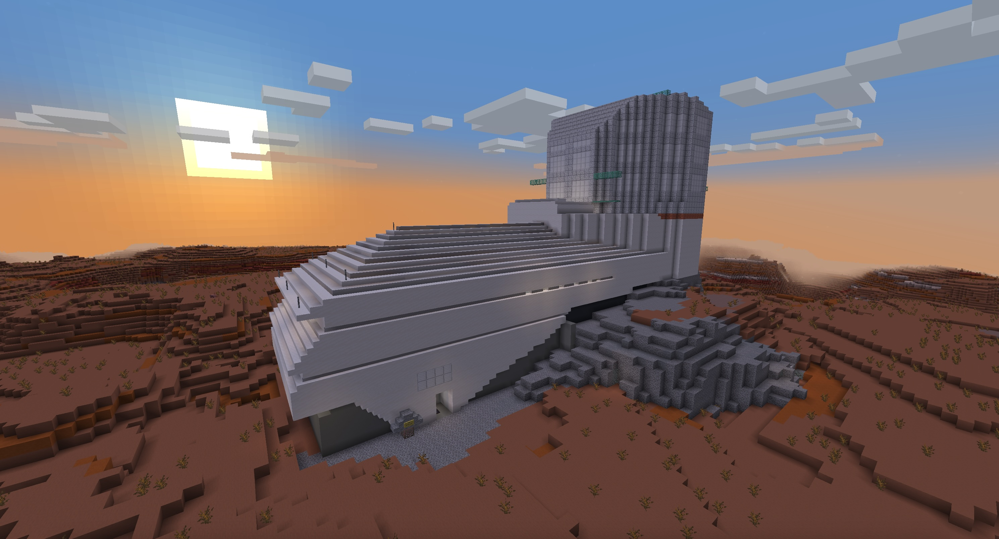
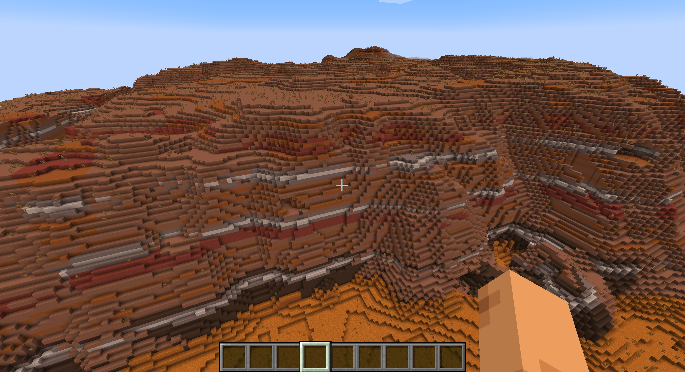
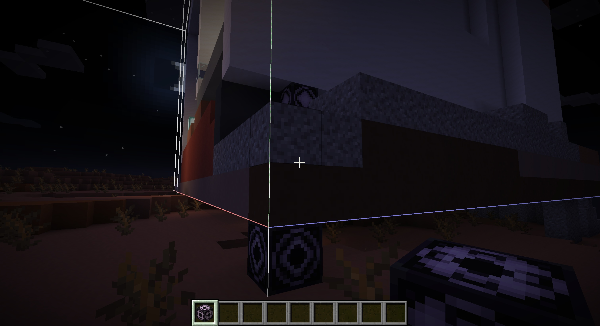
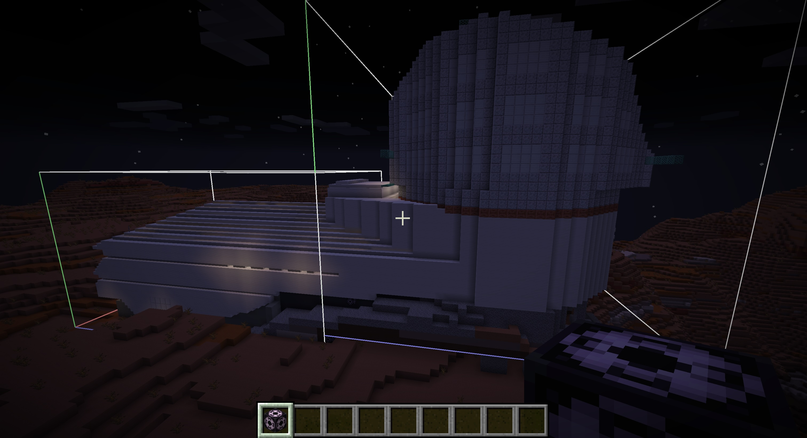

# Minecraft Rubin
Building a fullscale Vera C. Rubin Observatory in Minecraft! 

The goal of this project is to celebrate the incredible [Rubin Observatory](https://rubinobservatory.org), the [Simonyi Survey Telescope](https://www.lsst.org/about), and the Legacy Survey of Space and Time (LSST). Flying around telescope at night is a fun and accesible way to give a tour of this amazing facility!

This was built by [@jradavenport](https://github.com/jradavenport) mostly from memory, after visiting the site once in 2023... if you have better floorplans or Minecraft skills, send me an updated building!

## Requirements
This was built on Minecraft Java 1.21.4, using a Mac

## Installation
1. Save the `.nbt` files into the appropriate folder for a Minecraft world. On a Mac this should be something like:
   `/Users/USERNAME/Library/Application Support/minecraft/saves/Rubin-demo-v2/generated/minecraft/structures`

2. Load Minecraft. In your world, you'll need a [Structure Block](https://minecraft.fandom.com/wiki/Structure_Block). If cheats are enabled, you can do this easily with the command:
   `/give @s minecraft:structure_block`

3. Pick your observatory location! Find somewhere high and dry, just like the real Rubin site. (We like the Badlands biome for this). The telescope is more than 80 blocks long, so pick a large hilltop!
   

4. Load the Dome. We use a simple nested structure bock setup. Place a structure block, and load the first piece: `rubin-dome`
   

5. Load the Building. Right above the Dome loading structure block, there is another structure block that has the rest of the building. Jump up and load that one!
6. Enjoy! Go for a stroll, head up to the Dome, maybe add some details! At initial release the interior isn't finished, so let us know if you improve it.

   
